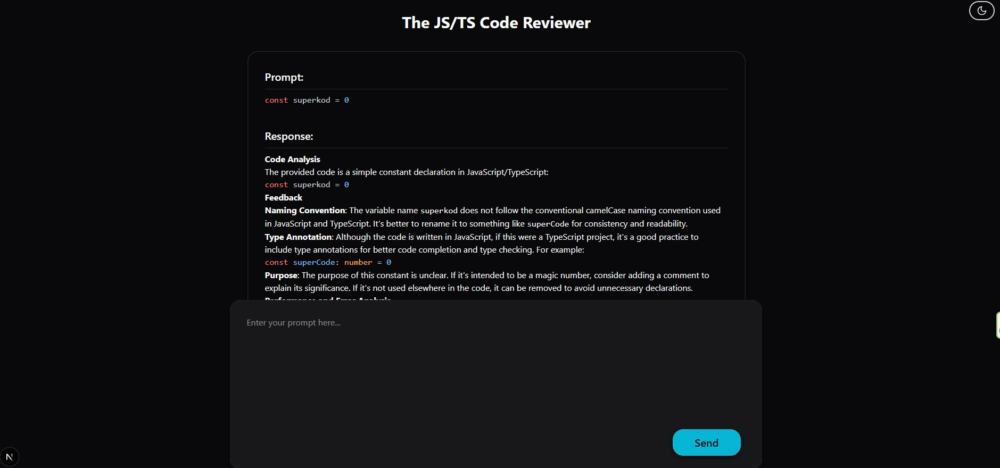
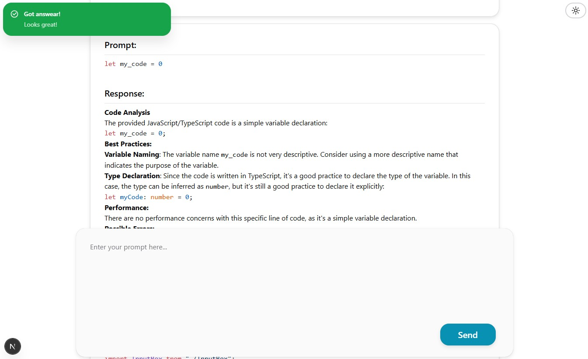
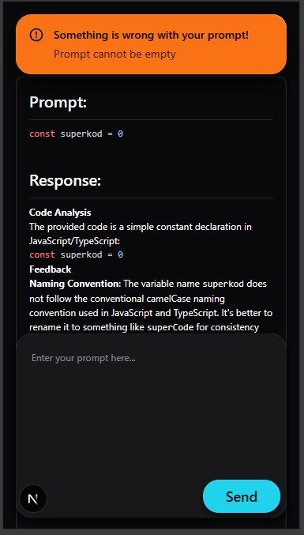
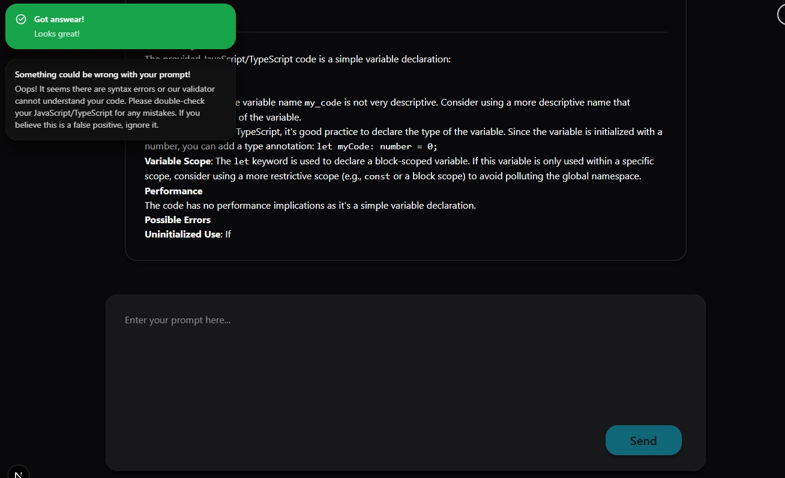
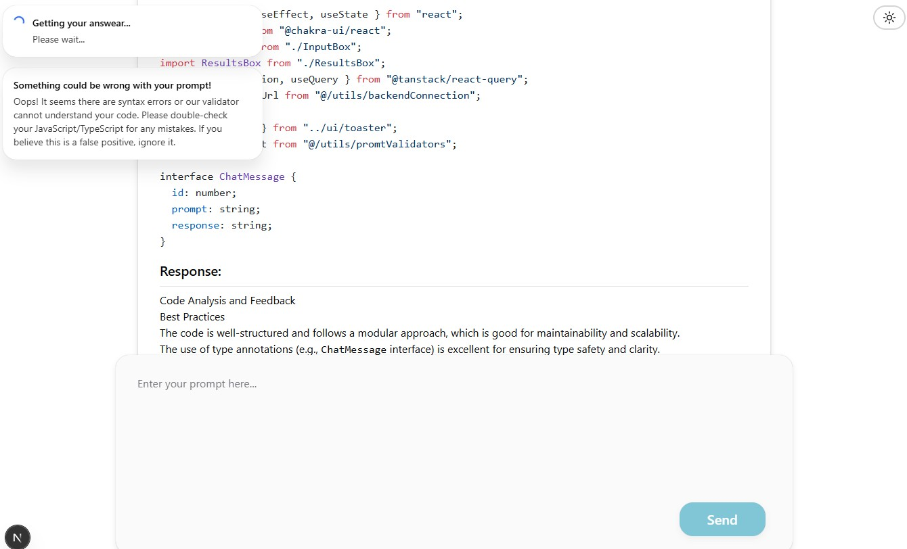

# JS/TS Code Reviewer

## Overview
JS/TS Code Reviewer is an AI-powered tool designed to analyze JavaScript and TypeScript code. It provides feedback on best practices, performance, and potential errors. The project consists of a **frontend** built with Next.js and Chakra UI, and a **backend** powered by Express.js and MongoDB.

---

## Features
- **Frontend**:
    - Interactive chat interface for submitting code snippets.
    - Syntax highlighting for JavaScript/TypeScript code.
    - Light/Dark mode toggle.
    - Responsive design using Chakra UI.

- **Backend**:
    - Integration with an external LLM (Large Language Model) for code analysis.
    - MongoDB database for storing chat history.
    - Rate limiting to prevent abuse.

---

## Images 







## Tech Stack
### Frontend
- **Framework**: Next.js
- **UI Library**: Chakra UI
- **State Management**: React Query
- **Styling**: CSS, Chakra UI themes
- **Code Highlighting**: React Markdown with Rehype Highlight

### Backend
- **Framework**: Express.js
- **Database**: MongoDB (via Mongoose)
- **Environment Variables**: dotenv
- **Rate Limiting**: express-rate-limit

---

## Installation

### Prerequisites
- Node.js (v18 or higher)
- MongoDB instance
- Environment variables configured in `.env` files for both frontend and backend.

### Steps
1. Clone the repository:
     ```bash
     git clone https://github.com/barszu/ChatApp.git
     cd ChatApp
     ```

2. Install dependencies:
     ```bash
     cd frontend
     npm install
     cd ../backend
     npm install
     ```

3. Configure environment variables:
     - **Frontend**: Create `.env.local` in `frontend` and set `NEXT_PUBLIC_BACKEND_URL`.
     - **Backend**: Create `.env.local` in `backend` and set:
         - `MONGODB_URI`
         - `MONGODB_DB`
         - `GROQ_API_KEY`
         - `FRONTEND_URL`

4. Start the development servers:
     - Frontend:
         ```bash
         cd frontend
         npm run dev
         ```
     - Backend:
         ```bash
         cd backend
         npm run dev
         ```

5. Build and start (production):
     - Frontend:
         ```bash
         cd frontend
         npm run build
         npm start
         ```
     - Backend:
         ```bash
         cd backend
         npm start
         ```

---

## Usage
1. Open the frontend in your browser (default: `http://localhost:3000`).
2. Enter a JavaScript/TypeScript code snippet in the input box.
3. View the AI-generated feedback in the results box.

---

## Project Structure
### Frontend
- **`src/components`**: Reusable React components.
- **`src/utils`**: Utility functions for validation and backend communication.
- **`src/app`**: Next.js pages and layout.

### Backend
- **`src/models`**: Mongoose schemas.
- **`src/controllers`**: Logic for handling database operations.
- **`src/services`**: External API integrations.
- **`src/util`**: Utility functions like database connection.

---

## Environment Variables
### Frontend
- `NEXT_PUBLIC_BACKEND_URL`: URL of the backend server.

### Backend
- `MONGODB_URI`: MongoDB connection string.
- `MONGODB_DB`: Name of the MongoDB database.
- `GROQ_API_KEY`: API key for the external LLM service.
- `FRONTEND_URL`: URL of the frontend application.

---


## License
This project is licensed under the MIT License.

---

## Acknowledgments
- **Chakra UI** for the beautiful UI components.
- **Next.js** for the powerful React framework.
- **MongoDB** for the database solution.
- **GROQ API** for the AI-powered code analysis.
